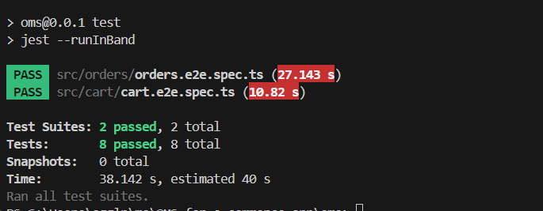
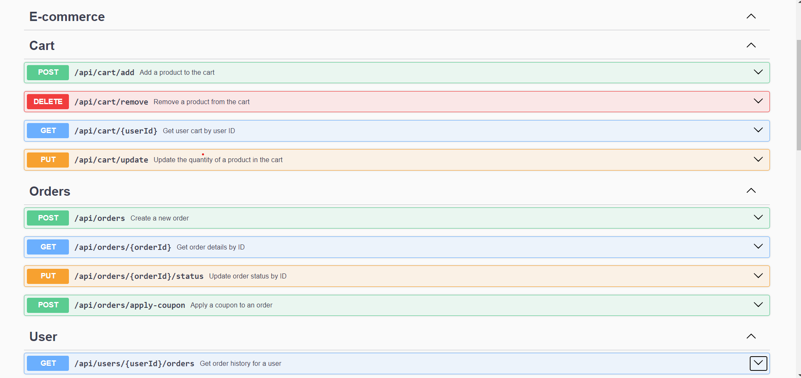

#  Order Management System (OMS) for E-Commerce App 


## Overview

The Order Management System (OMS) is an essential component of our e-commerce mobile application, designed to handle all aspects of order processing and management. This system allows users to add products to their cart, create orders, apply coupons, and retrieve their order history. It ensures a seamless shopping experience by integrating various functionalities such as viewing, updating, and removing items from the cart, as well as managing order status and applying discounts.

## Prerequisites

- Node.js
- npm or yarn
- PostgreSQL

## Setup Instructions

1. **Clone the repository**

   ```sh
   git clone https://github.com/Sara-Gamal1/OMS-for-e-commerce-app
   cd oms
   ```

2. **Install dependencies**

   ```sh
   npm install
   # or
   yarn install
   ```

3. **Set up the database**

   - Create a PostgreSQL database.
   - Create a `.env` file in the root directory and add the following content, replacing the placeholders with your actual database credentials:
     ```dotenv
     # Database connection
     DATABASE_URL=postgresql://<username>:<password>@<host>:<port>/<database>
     ```
     Replace `<username>`, `<password>`, `<host>`, `<port>`, and `<database>` with your actual PostgreSQL database credentials.

4. **Run database migrations**

   ```sh
   npx prisma migrate dev
   ```

5. **Seed the database**

   ```sh
   node .\prisma\seeds.js
   ```

6. **Start the application**
   ```sh
   npm run start
   # or
   yarn start
   ```
7. **Run tests**
   To execute all tests, use the following command:

      ```sh
      npm test
      ```

    

## API Endpoints

### Add to Cart

- **Endpoint**: `POST /api/cart/add`
- **Description**: This endpoint allows users to add a product to their cart. If the product is already in the cart, it updates the quantity (increases it by 1). The API returns an error if the request body is missing required fields, if the product ID is invalid, if the user or product does not exist, or if the product stock is insufficient.
### View Cart

- **Endpoint**: `GET /api/cart/:userId`
- **Description**:  This endpoint retrieves the cart for a specific user. It returns an error if the request body is missing required fields, if the product ID is invalid, or if the cart is not found for the user.

### Update Cart
- **Endpoint**: `PUT /api/cart/update`
- **Description**: This endpoint updates the quantity of a product in the user's cart. It returns an error if the request body is missing required fields, if the product ID is invalid, if the cart or product is not found, or if the product is not in stock with the required quantity.


### Remove From Cart

- **Endpoint**: `DELETE /api/cart/remove`
- **Description**: This endpoint removes a product from the user's cart. If the product quantity is 1, the product is removed; otherwise, the product quantity is decreased by 1. It returns an error if the request body is missing required fields, if the product ID is invalid, or if the user or product does not exist.


### Create Order

- **Endpoint**: `POST /api/orders`
- **Description**: This endpoint creates a new order for the specified user with the products in their cart. It verifies product availability and quantity before processing the order. It returns an error if the request body is missing required fields, contains invalid data, if the user's cart is empty, if the specified user ID does not exist, or if any product in the cart is not in stock or the requested quantity exceeds available stock.

### Get Order

- **Endpoint**: `GET /api/orders/:orderId`
- **Description**: This endpoint retrieves the details of a specific order by its order ID. It returns an error if
 the order with the specified orderId does not exist.

### Apply Coupon to Order
- **Endpoint**: `POST /api/orders/apply-coupon`
- **Description**:Applies a coupon to an order to apply a discount. Each order can have only one coupon applied at a time. It returns an error if the order with the specified orderId does not exist, if the request body is missing the couponCode or orderId fields, if the order already has a coupon applied, or if the provided couponCode is invalid.

### Update Order Status
- **Endpoint**: `PUT /api/orders/:orderId/status`
- **Description**: Updates the status of a specific order identified by orderId. It returns an error if the order with the specified orderId does not exist, if the request body is missing the status field, or if the provided status value is invalid.

### Get History of orders

- **Endpoint**: `GET /api/users/:userId/orders`
- **Description**: Retrieves a list of orders associated with a specific user identified by userId. It returns an error if the user with the specified userId does not exist or if no orders are associated with the user.

### For more detailed documentation, including request and response schemas, and additional features, please refer to the Swagger documentation provided with the application.


